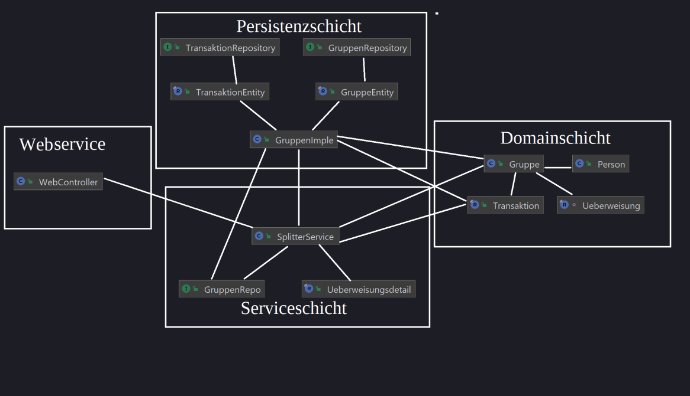

= Praktikum
:icons: font
:icon-set: fa
:source-highlighter: rouge
:experimental:

== Organisatorisches

Die finden die URL für das Webex System auf http://propra.de/ws2223/ab899545cb7e0df[dieser Seite]. Wir hoffen, dass die Webex-URL über das ganze Praktikum über gleich bleibt, können aber nicht ausschließen, dass es Änderungen geben muss. 

Wenn es wichtige Ankündigungen zum Praktikum gibt, werden wir diese sowohl im Diskussionsforum als auch auf der URL Seite online stellen. 

IMPORTANT: Verwenden Sie in Webex als Display-Name Ihren Namen und in Klammern dahinter das GitHub-Login. Beispiel: `William Bruce Rose (axl62)`.

Sie können Ihren Namen in der Teilnehmerliste über den „Edit Display Name”-Menüpunkt ändern. In der App finden Sie den Menüpunkt durch Rechtsklick auf Ihren Namen, im Browser über die drei Punkte neben dem Namen.

=== Aufgabenstellung

Die Beschreibung der Aufgabe finden Sie in link:aufgabe.adoc[diesem Dokument].

=== Ergänzungen zur Aufgabenstellung

Es gibt zwei geplante Ergänzungen zur Aufgabenstellung. Sie erhalten die erste Ergänzung (Beschreibung von Testszenarien) am 02.03.2023 vor Beginn der Praktikumszeit. Die zweite Ergänzung (Einbau einer neuen Funktionalität) erhalten Sie am 08.03.2023 vor Beginn der Praktikumszeit. 

Die Ergänzungsaufgaben werden wir auf der http://propra.de/ws2223/ab899545cb7e0df[URL Seite] verlinken. 

=== Deadlines 

Wir beginnen mit einer Teilbegutachtung der Anwendung am 14.03.2023 ab 13:00 Uhr. Zu diesem Zeitpunkt muss die Anwendung bis auf die Persistenz fertig sein. Die komplette Anwendung muss am 17.03.2023 um 13:00 Uhr fertiggestellt sein. 

== Fragen und Hilfestellungen

Für Fragen gibt es zum einen die Diskussionsforen, die Sie unbedingt bei Fragen verwenden müssen, die auch für andere Teilnehmer:innen interessant seien könnten.

* Fragen zu organisatoischen Themen stellen Sie bitte im Forum https://github.com/hhu-propra2-ws22/Organisation/discussions/categories/fragen-zur-organisation[Fragen zur Organisation].
* Für Fragen zur Aufgabenstellung haben wir ein neues Forum https://github.com/hhu-propra2-ws22/Organisation/discussions/categories/fragen-zur-aufgabestellung[Fragen zur Aufgabenstellung] erstellt.
* Wenn Sie Fragen zum Stoff der Vorlesung haben, stellen Sie diese bitte weiterhin im Forum https://github.com/hhu-propra2-ws22/Organisation/discussions/categories/fachliche-fragen[Fachliche Fragen]

Außerdem werden Sie von unseren Tutor:innen regelmäßig besucht und haben dort ebenfalls die Gelegenheit, Fragen zu stellen. Kristin, Leonie und Jens kommen Sie auch gelegentlich besuchen oder helfen aus, wenn besonders schwierige Fragen auftreten sollten. 

Bei Fragen, die Sie selber persönlich betreffen (zum Beispiel bei Krankmeldungen), wenden Sie sich bitte per Mail an mailto:propra@cs.hhu.de[propra@cs.hhu.de]. Stellen Sie dort bitte keine Fragen, die auch in den Foren geklärt werden könnten. 

== Verhaltensregeln

Wir erwarten von Ihnen einen respektvollen Umgang miteinander. Es gilt grundsätzlich bei uns der https://berlincodeofconduct.org/de/[Berlin Code of Conduct]. Die Tutor:innen haben die Aufgabe, die Einhaltung der Regeln zu überwachen und können bei Verstößen gegen den Verhaltenskodex Personen aus dem Praktikum ausschließen. Ein Praktikumsausschluss hat zur Folge, dass Sie das Modul in diesem Semester nicht mehr abschließen können. 

== Architetukrdokumentation

=== Starten des Systems

- CLIENT_ID und CLIENT_SECRET müssen gesetzt werden.

=== *1. Einführung und Ziele*
==== *1.1 Aufgabenstellung*
===== Was ist Splitter?
Splitter ist eine Seite um das gemeinsame Tätigen bei Aktivitäten zu erleichtern, indem es die Ausgaben transparent anzeigt und ausgleicht.

===== Features:

 * Gruppen erstellen

 * Automatische Berechnung der Schulden

==== 1.2 Qualitätsziele

. Transparenz

* Die Schulden zwischen den Gruppenmitgliedern kann auf einem Blick gesehen werden

. Effizienz

* Sobald die Aktivitäten angegeben werden, werden die Schulden in Echtzeit angezeigt

. Sicherheit

* Nutzer werden über GitHub authentifiziert und nur die eigenen Gruppen werden angezeigt

=== 2. Randbedingungen

==== 2.1 Technisch

. Implementierung in Java

* Das Programm wurde komplett mit Java geschrieben und läuft auch mit hauptsächlich Java

. Testgetriebene Entwicklung

* Tests wurden parallel zum Code geschrieben

. Authentifizierung

* Das System verwendet GitHub OAuth2 zur authentifizierung von Personen

. Web-Framework

* Das System verwendet Spring Boot als Web Injection Framework

. Gradle

* Build Prozess wird mit Gradle automatisiert

. Architektur

* Das Projekt soll sich an die Onion-Architecture halten

==== 2.2 Organisatorisch

. Zeitplan

* Das Projekt wurde innerhalb von 3 Wochen, an denen Montag-Freitag jeweils 4 Stunden gearbeitet wurde, fertiggestellt

. Remote

* Das Projekt wurde von Personen geschrieben, die alle Remote gearbeitet haben

==== 2.3 Konvention

. Architekturdokumentation

* Die Dokumentation basiert auf arc42

. Google-Styleguide

* Der Code wurde nach den Regeln des Google-Styleguide geschrieben

. Kodierrichtlinien für Java

* Es wurde an die Coding Konventionen gehalten

=== 3. Kontextabgrenzung

==== 3.1 Fachlicher Kontext

Nutzer kann Gruppen erstellen und andere Nutzer hinzufügen.

In der Gruppe können Aktivitäten angegeben werden:

* Wie viel Geld wurde ausgegeben

* Wer hat an den Aktivitäten teilgenommen

* Weshalb wurde Geld ausgegeben

==== 3.2 Technischer Kontext

Die Seite wurde mit HTML geschrieben und entnimmt die Werte aus dem Java Code.

=== 4. Lösungsstrategie

Am Anfang wurde die HTML Seite skizziert, um zu schauen, welche Klassen erstellt werden müssen. Als erstes sind wir die Domain-Ebene angegangen und eine Klasse für Gruppe und eine
Klasse für Person wurde erstellt. Die Person selber hat lediglich einen Namen und kann eine Gruppe erstellen. In der Gruppe haben wir erst die einfachen Features eingefügt, wie zum Beispiel
das Hinzufügen der Mitglieder. Wir wussten nicht, wie wir das Geld ausgeben bzw. Schulden berechnen schreiben sollten und haben daher zuerst die Tests geschrieben und haben dadurch eine
Idee bekommen, wie der Code auszusehen hat. Anfänglich wurde für das Geld ein primitiver Datentyp benutzt und später wurde das in eine eigene Klasse gepackt.

Mit der Domain-Ebene fertig, wurde die HTML Seite noch einmal skizziert. 2 HTML Seiten werden benötigt. Da die Persiszent Schicht noch nicht angegangen wurde, wird eine HashMap benutzt,
um das Repository gut darstellen zu können. Der Controller wurde parallel zu den Services geschrieben, damit natürlich auch die HTML Seiten.

Um Speicherplatz in der Datenbank zu sparen, werden die Überweisungen nicht gespeichert, sondern werden jedes mal neu berechnet.

=== 5. Bausteinsicht

Domain-Schicht: Unsere Domain-Schicht besteht aus 6 Klassen, aufgeteilt in 2 Aggregate.

=== 6. Laufzeitsicht

Die Daten, welche das System über die Benutzereingaben bekommt, werden dem Controller
übergeben. Der Controller gibt die Daten an das Service weiter und verarbeiten diese. Danach
werden Informationen an den Controller zurückgegeben und diese werden auf der Webseite angezeigt.

=== 7. Verteilungssicht

Servervoraussetzungen:

- Java 17

- Gradle 7.3+

Benutzervoraussetzungen:

- Browser mit HTML5

=== 8. Entscheidungen

Onionarchitektur

Durch eine Onionarchitektur versichern wir uns unter anderem eine geringere Kopplung und eine hohe Kohäsion zu erreichen.

Domain Driven Design

Spring Data JDBC basiert auf DDD Prinzipien. Aus diesem Grund haben wir uns entschieden unsere Domäne nach DDD
zu modellieren.

Spring Security OAuth2

Wir haben ein Spring Boot System entwickelt, weshalb wir Spring Security OAuth2 benutzen,
um die Sicherheit in unserem Programm gewährleisten zu können.

=== 9. Qualitätsanforderungen

Wartbarkeit

- Das Projekt lässt sich sehr einfach konfigurieren. Erweiterungen sind möglich.

Benutzerfreundlichkeit

- Die Webanwendung hält sich an Vorgaben der Kontraste und ist von einem Screenreader lesbar. Bei der Erstellung
der HTML-Seiten haben wir Thymeleaf verwendet um ein benutzerfreundliches Design zu ermöglichen.

Sicherheit

- Durch Spring Security OAuth2 haben wir die Sicherheit in unserem System gewährleistet.

Kompatibilität

- Das Projekt ist kompatibel mit allen Betriebssystemen und jedem modernen Browser, sowie auf iOS und Android Geräten.

=== 10. Risiken

Die Authentifizierung ist abhängig von GitHub, falls die GitHub Server nicht erreichbar sind kann der Login nicht
erfolgen.

=== 11. Glossar

|========
| Begriff       | Definition

| Transaktion   | Transaktion enthält Informationen, also Grund (wofür man bezahlt hat), Geldbetrag ( wie viel man bezahlt hat) und Empfängern ( für welche Personen man bezahlt hat)

| Überweisung   | Überweisung enthält die Informationen über die Schuldenausgleicher